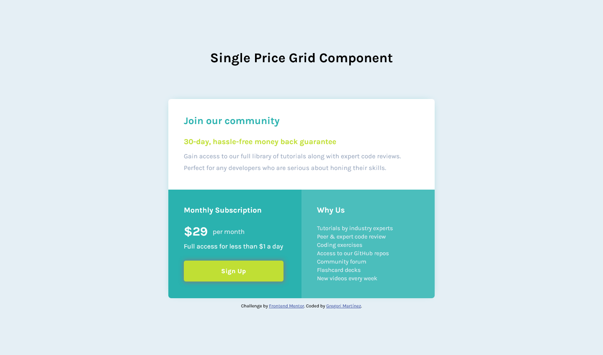

# Frontend Mentor - Single price grid component solution

This is a solution to the [Single price grid component challenge on Frontend Mentor](https://www.frontendmentor.io/challenges/single-price-grid-component-5ce41129d0ff452fec5abbbc). Frontend Mentor challenges help you improve your coding skills by building realistic projects. 


## Table of contents

- [Overview](#overview)
  - [The challenge](#the-challenge)
  - [Screenshot](#screenshot)
  - [Links](#links)
- [My process](#my-process)
  - [Built with](#built-with)
  - [What I learned](#what-i-learned)
  - [Continued development](#continued-development)
  - [Useful resources](#useful-resources)
- [Author](#author)


## Overview

### The challenge

Users should be able to:

- View the optimal layout for the component depending on their device's screen size.
- See a hover state on desktop for the Sign Up call-to-action.

### Screenshot

Below you'll see a screenshot of the final result on desktop view.



### Links

- Repository: [Click here to check it out](https://github.com/GregoriM04/single-price-grid-component-master.git)
- Live Site URL: [Click here to check it out](https://)


## My process

### Built with

- Semantic HTML5 markup
- CSS custom properties
- Flexbox
- CSS Grid
- Mobile-first workflow

### What I learned

With this challenge, for the first time, I was able to put in practice CSS Crip layout, and I'm proud of my work because I think I did a good research and used all new concepts correctly to get the best result possible, at least over this particular challenge.

Here you can see a little bit of the code I used:

```css
.card {
  display: grid; 
  grid-template-columns: repeat(2, 1fr); 
  grid-template-rows: repeat(2, 1fr); 
  gap: 0px; 
  grid-template-areas: 
    "section-one section-one"
    "section-two section-three"; 
}
```

### Continued development

I know this is just the beginning, but I hope that with time and more challenges, I can improve the knowledge I just got. 

### Useful resources

- [Learnd CSS Grid](https://learncssgrid.com/) - This helped me to undertand the basis of CSS Grid and how to use its properties correctly.

- [CSS-Tricks](https://css-tricks.com/snippets/css/complete-guide-grid/) - This is an amazing article which helped me finally understand how to display the properties of CSS Grid and visualizely in a better way with an excellent explanation.


## Author

- LinkedIn - [Gregori Martinez](https://www.linkedin.com/in/gregorim04/)
- Frontend Mentor - [@GregoriM04](https://www.frontendmentor.io/profile/GregoriM04)
- Twitter - [@GregoriM04](https://twitter.com/GregoriM04)
